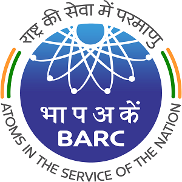

I recently graduated with a Master's degree in Information Systems with a specialization in Data Science and Analytics from the University of Maryland - [Robert H. Smith School of Business](https://www.rhsmith.umd.edu/). My past professional experiences and projects have equipped me with immense knowledge and expertise in the field of Data Analytics, Machine Learning, Business Intelligence, and Software Development. I also believe my extra-curricular and co-curricular activities throughout my undergraduate studies have helped me develop my soft skills. I am currently seeking new opportunities that require a perfect blend of the skills I possess.
   
# Education
-----

**MS in Information Systems, [University of Maryland](https://www.umd.edu/)**
#### August 2019 - December 2020 | Maryland, USA

-----
I am currently pursuing my Graduate Degree in Information Systems from the University of Maryland with a focus in Data Science & Analytics.    
<strong>CGPA: </strong> 3.78/4.0  
<strong>Relevant coursework:</strong> Data Modelling, Big Data and Artificial Intelligence, Database Management Systems, Data Processing - Python, Data Mining in R, Business Process Analysis, Project Management, Management Information Systems, Google Analytics  

-----

**B.Tech in Information Technology, [University of Mumbai](https://mu.ac.in/)**
#### August 2015 - June 2019 | Mumbai, India

-----
I completed my Undergraduate Degree in Information Technology from the University of Mumbai - K.J Somaiya College of Engineering in 2019.    
<strong>CGPA:</strong> 3.7/4.0   
<strong>Relevant coursework:</strong> Artificial Intelligence, Machine Learning, Big Data Analytics, Data Warehousing and Mining, Neural Networks and Fuzzy Logic, Image Analysis, Introduction to Business Intelligence, Fundamentals of Programming, Data Structures, Analysis of Algorithms, Operating Systems, Object Oriented Programming, Applied Mathematics  
 
# Experience
-----

**Data Analyst Intern, [University of Maryland](https://www.umd.edu/)** 
#### May 2020 - December 2020 | College Park, USA
----- 
*	Evaluated business needs and developed an automated platform to manage the funding requests of the University
*	Optimized operational processes of the University by 56%+ and reduced 48+ man-hours per week
*	Spearheaded research on collection and processing of raw unstructured water desalination data
*	Designed & created a normalized relational MySQL database to surface new insights to act on business opportunities
*	Reengineered the existing architecture of multiple databases by enhancing performance of CRUD operations by 27% 

-----

**Business Analyst Contract, [Poshare](https://poshare.com/)**
#### January 2020 - May 2020 | College Park, USA
-----
*	Collaborated with cross-functional teams to re-design and launch the firm’s online marketing strategy
*	Orchestrated A/B test plans to validate customer hypotheses and understand customer behavior patterns
*	Decreased the bounce rate by 52%, increased the session time by 69% by running a 27-day Google Ads Campaign

-----

**Software Development Intern, [B.A.R.C](http://www.barc.gov.in/)** 
#### June 2018 - September 2018 | Mumbai, India
-----
*	Conceptualized and created an application having functionalities to filter emails based on sender, subject, and date
*	Implemented multi-factor authentication to alleviate security vulnerabilities and insulate system against remote attacks
*	Awarded with the “Best Intern” title for technical proficiency, critical thinking, and receptiveness among 100+ interns

 

# Key Skills
----
* <strong> Programming Languages: </strong> Python, R, Java, HTML5, CSS3, C, Javascript  
* <strong> Operating Systems: </strong> Windows, Linux, Ubuntu  
* <strong> Libraries: </strong> PyTorch, Tensorflow, Keras, Numpy, Pandas, Matplotlib, Seaborn, Scikit-learn, Statsmodel, NLTK, Caret, Ggplot  
* <strong> Databases: </strong> MySQL, PostreSQL, T-SQL, MongoDB, SSMS, SSIS  
* <strong> Visualization Tools: </strong> Tableau, PowerBI, Qlikview  
* <strong> Modeling: </strong> Linear Regression, Logistic Regression, SVM, Decision Trees, Random Forests, Bagging, Boosting, K-means, KNN, Latent Dirichlet Allocation, Sentiment Analysis, Lasso Regression, Ridge Regression, Naïve Bayes, Deep Neural Networks, Convolutional Neural Networks, ARIMA, SARIMA  
* <strong> Tools: </strong> AWS SageMaker, AWS Lambda, AWS EC2, AWS API Gateway, Jira, Git, MS Excel  
  
----
