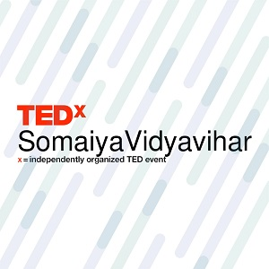
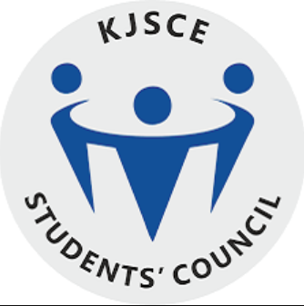
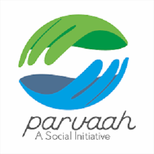

-----

**Sponsorship Head, TEDxSomaiyaVidyavihar**
#### June 2018 - April 2019 | Mumbai, India

-----
* Headed a team of undergraduates and graduates to raise funds and saw a 200% increase from preceding years.
* Was in charge of coordinating sponsorship solicitation and fundraising efforts, and planning sponsorship strategy
* Managed all marketing activities and other events to assist in achieving the business objectives
* Delegated tasks to team members to ensure the most profitable outcome  

-----

**Marketing Secretary, KJSCE Students' Council**
#### June 2017 - June 2018 | Mumbai, India

-----
* Was responsible for sponsor prospecting, proposal customization and presentation, contract revision and servicing, sponsor follow-up and support
* Raised INR 4.5 million for various students’ activities, a 50% increase as compared to previous year.
* Established an intra-departmental competition to increase participation from students across the college
* Introduced Kabaddi and Kho-Kho which proved to be successful sports for the college  

-----

**Ladies Respresentative, KJSCE Students' Council**
#### June 2016 - June 2017 | Mumbai, India

-----
* Was responsible for all the sporting activities of the college and helped budding sportsmen prove their talent in state and national level competitions
* Galvanized all the sports teams of the college to participate in competitions across the country
* Established an intra-departmental competition to increase participation from students across the college
* Introduced Kabaddi and Kho-Kho which proved to be successful sports for the college  

-----

**Convener, KJSCE Parvaah**
#### June 2016 - June 2019 | Mumbai, India

-----
* Championed for the rights of the LGBTQ+ community in Mumbai through pride walks, cycle rallies and workshops
* Spread awareness about health and sanitation by attending regular beach cleanups and by beautifying a railway station in Mumbai, India  

-----

