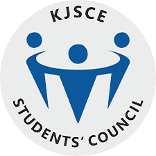

-----

**Sponsorship Head, TEDxSomaiyaVidyavihar**
#### June 2018 - April 2019 | Mumbai, India

-----
* Headed a team of undergraduates and graduates to raise funds and saw a 200% increase from preceding years
* Was in charge of coordinating sponsorship solicitation and fundraising efforts, and planning sponsorship strategy
* Managed all marketing activities and other events to assist in achieving the business objectives
* Delegated tasks to team members to ensure the most profitable outcome  

-----

**Marketing Secretary, KJSCE Students' Council**
#### June 2017 - June 2018 | Mumbai, India

-----
* Was responsible for sponsor prospecting, proposal customization and presentation, contract revision and servicing, sponsor follow-up and support
* Raised INR 4.5 million for various students’ activities, a 50% increase as compared to previous year
* Ensured sponsorship for every event during the annual festivals, thus increased participation by 100%
* Provided briefings to other team members as necessary or as requested  

-----

**Ladies Respresentative, KJSCE Students' Council**
#### June 2016 - June 2017 | Mumbai, India

-----
* Worked towards the equality of women at the department as well as the avoidance of discrimination against female members of the university and female applicants
* Hosted events focusing on Women’s safety and had timely meetings with the Women’s Development Cell 
* Led a team of 40 individuals to host the Women's Day celebration  

-----

**Convener, KJSCE Parvaah**
#### June 2016 - June 2019 | Mumbai, India

-----
* Championed for the rights of the LGBTQ+ community in Mumbai through pride walks, cycle rallies and workshops
* Spread awareness about health and sanitation by attending regular beach cleanups and by beautifying a railway station in Mumbai, India  

-----

